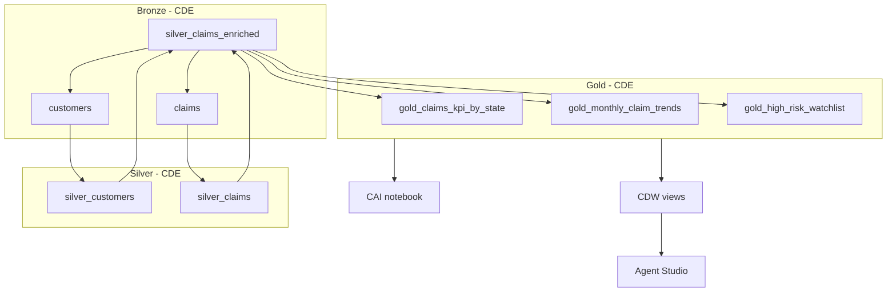

# Insurance Analytics — End-to-End Cloudera Workshop

**Scenario:** Insurance claims fraud and exposure analytics across **CDE**, **Iceberg**, **CDW**, **CAI Workbench**, and **Agent Studio**.

**Environment defaults:** user `holuser01`, database `holuser01_insurance_analytics`, raw data at `s3a://cloudera-hol-buk-99feb843/data/user/holuser01/`.

---

## Workshop map

| Step | Platform | Outcome |
|------|----------|---------|
| 1 | CDE + Spark | Bronze: `customers` |
| 2 | CDE + Spark | Bronze: `claims` |
| 3 | CDE + Spark (6 jobs) | Silver + GX DQ + Gold medallion tables |
| 4 | CDW | 2 reporting views |
| 5 | CAI Workbench | Forecast + fraud snapshot notebook |
| 6 | Agent Studio | NL → SQL agent on gold data |



---

## Step 1 — Load customer data (Bronze)

**Script:** `cde/01_load_customers_iceberg.py`  
**CDE job name:** `holuser01_01_load_customers_iceberg`

1. Upload scripts to a CDE **Resource**.
2. Create a **Spark** job; select `01_load_customers_iceberg.py`.
3. **Run** the job.

**Result:** Iceberg table `holuser01_insurance_analytics.customers` (~100k rows).

**Validate:**

```sql
SELECT COUNT(*) FROM holuser01_insurance_analytics.customers;
```

**Optional sample — data quality on `customers`:**

| Job name | Script | When to run |
|----------|--------|-------------|
| `holuser01_09_data_quality_customers` | `09_data_quality_customers.py` | Right after Step 1 |

**Great Expectations on CDE (jobs 08 & 09):** create a **Python Environment** resource first, then point the job at it. Full steps: **[docs/CDE_PYTHON_ENVIRONMENT.md](./docs/CDE_PYTHON_ENVIRONMENT.md)**.

Summary:

1. **Resources** → **Create Resource** → type **Python Environment** (e.g. `holuser01-python-gx`).
2. Add packages from **`cde/requirements.txt`** (`great_expectations==0.18.22`) and wait until the environment is **Ready**.
3. Edit job **09** → **Configurations** → **Python Environment** → select `holuser01-python-gx`.
4. **Application file** stays in your **Files** resource (`holuser01-insurance`); libraries live in the Python Environment.

Flow: Spark session → `spark.table("…customers")` → Great Expectations (null/unique `customer_id`, age/state/score ranges, ~100k row count).

---

## Step 2 — Load claims data (Bronze)

**Script:** `cde/02_load_claims_iceberg.py`  
**CDE job name:** `holuser01_02_load_claims_iceberg`

Run after Step 1 succeeds. Uses `claims.parquet` under the same S3 prefix (or `claims_1m_sample.parquet` for a shorter run — update `claims_path` in the script).

**Result:** Iceberg table `holuser01_insurance_analytics.claims`.

**Validate:**

```sql
SELECT policy_type, COUNT(*) FROM holuser01_insurance_analytics.claims
GROUP BY policy_type;
```

---

## Step 3 — Medallion + data quality on CDE (6 jobs)

Bronze tables from Steps 1–2 feed **silver/gold** PySpark jobs plus a **Great Expectations** quality gate. Create one CDE Spark job per script; run **in order** (or use Airflow — `cde/medallion_airflow_dag.py`).

| Order | Job name | Script | Layer | Output / purpose |
|-------|----------|--------|-------|------------------|
| 3a | `holuser01_03_silver_customers` | `03_silver_customers.py` | Silver | `silver_customers` |
| 3b | `holuser01_04_silver_claims` | `04_silver_claims.py` | Silver | `silver_claims` |
| 3c | `holuser01_05_silver_claims_enriched` | `05_silver_claims_enriched.py` | Silver | `silver_claims_enriched` |
| 3d | `holuser01_08_data_quality_great_expectations` | `08_data_quality_great_expectations.py` | Quality | Validates `silver_claims_enriched` (fails job if checks fail) |
| 3e | `holuser01_06_gold_kpi_by_state` | `06_gold_kpi_by_state.py` | Gold | `gold_claims_kpi_by_state` |
| 3f | `holuser01_07_gold_trends_and_watchlist` | `07_gold_trends_and_watchlist.py` | Gold | `gold_monthly_claim_trends`, `gold_high_risk_watchlist` |

**Job 08 (Great Expectations):**

1. Create Spark session  
2. `spark.table("holuser01_insurance_analytics.silver_claims_enriched")`  
3. Run expectation suite on the DataFrame (null checks, amount ranges, state/band domains, claim_id uniqueness proportion)

Attach the **Python Environment** resource (see [CDE_PYTHON_ENVIRONMENT.md](./docs/CDE_PYTHON_ENVIRONMENT.md)).

**Run gold jobs (3e–3f) only after job 08 passes.**

**Silver logic (summary):**

- Valid ages, states, fraud bands on customers.
- Valid amounts, statuses, `claim_month` on claims.
- Inner join → enriched fact.

**Gold logic (summary):**

- KPIs by state and policy type (counts, amounts, denied vs high-risk).
- Monthly trends for forecasting.
- Watchlist for fraud ops (HIGH band, large claims).

**Validate after 3f:**

```sql
SELECT COUNT(*) FROM holuser01_insurance_analytics.silver_claims_enriched;
SELECT * FROM holuser01_insurance_analytics.gold_claims_kpi_by_state LIMIT 5;
```

**Optional orchestration:** Deploy `medallion_airflow_dag.py` to CDE Airflow to chain Steps 1–3f (DQ job 08 runs before gold).

---

## Step 4 — Reports and views on CDW

1. Open **Data Warehouse** → connect to your **Virtual Warehouse**.
2. Open **Hue** (or CDW SQL editor) with the VW endpoint.
3. Run `cdw/create_views.sql`.

**Views created:**

| View | Purpose |
|------|---------|
| `vw_executive_claims_by_state` | Executive dashboard — totals by state |
| `vw_high_risk_claims_report` | Fraud analyst watchlist report |

**Sample queries for participants:**

```sql
SELECT * FROM holuser01_insurance_analytics.vw_executive_claims_by_state
ORDER BY total_claim_amount DESC LIMIT 10;

SELECT policy_type, COUNT(*) FROM holuser01_insurance_analytics.vw_high_risk_claims_report
GROUP BY policy_type;
```

**Optional:** Build a **Data Visualization** dashboard in CDW on `vw_executive_claims_by_state` (bar chart: state vs `total_claim_amount`).

---

## Step 5 — CAI Workbench (Jupyter)

1. Open **Cloudera AI** → **Workbench** → **New Session** (Python 3, Spark-enabled runtime if available).
2. Upload or git-import `cai/notebooks/insurance_claims_forecast.ipynb`.
3. Run all cells.

**What the notebook demonstrates:**

- Reads `gold_monthly_claim_trends` via Spark.
- Builds a **3-month rolling average** forecast by policy type.
- Optional **linear trend** on total monthly volume.
- Summarizes `gold_high_risk_watchlist` by state.

**Talking point:** ML/forecasting runs on **curated gold** data — not raw bronze files.

---

## Step 6 — Agent Studio workflow

Follow **`cai/agent_studio/insurance_claims_agent_workflow.md`**.

**Summary:**

1. Create agent **Insurance Claims Analyst**.
2. Attach **SQL / Warehouse** tool → database `holuser01_insurance_analytics`.
3. Paste the system prompt from the guide (use views + gold tables only).
4. Demo NL questions that map to `vw_executive_claims_by_state` and `gold_high_risk_watchlist`.

**Talking point:** Agents consume **the same governed catalog** as CDW and CDE — no shadow copies.

---

## Artifact checklist

| Path | Description |
|------|-------------|
| `cde/01–02` | Bronze ingest |
| `cde/03–07` | Medallion silver/gold |
| `cde/08_data_quality_great_expectations.py` | GX on `silver_claims_enriched` |
| `cde/09_data_quality_customers.py` | Sample GX on `customers` |
| `cde/requirements.txt` | Package list for CDE **Python Environment** resource |
| `docs/CDE_PYTHON_ENVIRONMENT.md` | Create & attach GX environment on CDE |
| `cde/medallion_airflow_dag.py` | Full pipeline DAG |
| `cdw/create_views.sql` | CDW views |
| `cai/notebooks/insurance_claims_forecast.ipynb` | Forecast lab |
| `cai/agent_studio/insurance_claims_agent_workflow.md` | Agent Studio lab |
| `instructor/INSTRUCTOR_GUIDE.md` | Setup and timing |

---

## Troubleshooting

| Symptom | Likely fix |
|---------|------------|
| Low `silver_claims_enriched` count | Expected: only claims whose `customer_id` exists in `silver_customers` (1–100k) join. |
| CDW cannot see tables | Sync metadata / use same Hive metastore catalog as CDE; `USE holuser01_insurance_analytics`. |
| Notebook Spark session fails | Enable Hive support; confirm VW or compute catalog is attached per CAI docs. |
| Agent returns wrong SQL | Add knowledge doc with table list; restrict tool to read-only views. |

---

## Reference

- CDE lab pattern: [DataServicesLabs / ClouderaDataEngineering](https://github.com/cloudera/DataServicesLabs/tree/main/ClouderaDataEngineering)
