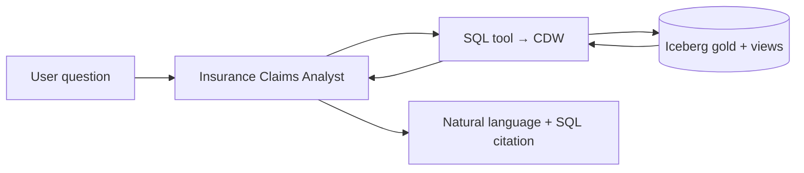

# Agent Studio — Insurance Claims Assistant

Demonstrate **Cloudera AI Agent Studio** connected to the same **Iceberg / Hive** data produced in CDE (gold layer + CDW views).

## Workflow objective

An agent answers natural-language questions about claim exposure, fraud risk, and trends by calling **SQL against CDW** (or a registered data connection), without copying data out of the platform.

Example questions:

- "Which five states have the highest total claim amount?"
- "How many high-risk watchlist claims are still pending?"
- "Summarize Auto vs Home claim counts from the executive view."

---

## Prerequisites

- Medallion pipeline complete; CDW views created (`cdw/create_views.sql`).
- **Cloudera AI** enabled in tenant; **Agent Studio** access for `holuser01`.
- Virtual Warehouse (CDW) or Hive connection available to Agent Studio as a **tool** / **data source** (name varies by release — use your environment’s SQL or Warehouse connector).

---

## Step 1 — Create a knowledge snippet (optional)

Add a short **Knowledge** document:

| Term | Definition |
|------|------------|
| `gold_claims_kpi_by_state` | Gold KPI table by state and policy type |
| `gold_high_risk_watchlist` | Claims with HIGH fraud band and amount ≥ 50k |
| `vw_executive_claims_by_state` | CDW view for executive reporting |
| Fraud band | HIGH ≥ 0.85, MEDIUM ≥ 0.60, else LOW |

Upload as context so the agent uses correct table names.

---

## Step 2 — Configure SQL / warehouse tool

1. Open **Agent Studio** → **New Agent** (name: `Insurance Claims Analyst`).
2. Add a tool that runs SQL on CDW/Hive (e.g. **SQL Query**, **Warehouse**, or MCP SQL tool if configured).
3. Set default database: `holuser01_insurance_analytics`.
4. Restrict read-only access to:
   - `gold_claims_kpi_by_state`
   - `gold_monthly_claim_trends`
   - `gold_high_risk_watchlist`
   - `vw_executive_claims_by_state`
   - `vw_high_risk_claims_report`

---

## Step 3 — System prompt (paste into agent instructions)

```text
You are an insurance analytics assistant for the Cloudera workshop.

Rules:
- Answer using SQL against database holuser01_insurance_analytics only.
- Prefer views vw_executive_claims_by_state and vw_high_risk_claims_report for reporting.
- Prefer gold_* tables for detailed analysis.
- Always show the SQL you ran, then a concise summary (2–4 sentences).
- If the question is ambiguous, ask one clarifying question.
- Do not invent columns; if unsure, describe the schema from information_schema or SHOW TABLES.
```

---

## Step 4 — Suggested workflow graph



**Nodes:**

1. **Input** — user message  
2. **Agent** — reasoning + tool selection  
3. **Tool: SQL** — execute read-only query  
4. **Output** — formatted answer  

If your Agent Studio version supports **multi-step workflows**, add a **validation** step: re-run a `COUNT(*)` sanity check when the user asks for totals.

---

## Step 5 — Demo script (5 minutes)

| # | User says | Expected behavior |
|---|-----------|-------------------|
| 1 | "Top 5 states by total claim amount from the executive view." | `SELECT ... FROM vw_executive_claims_by_state ORDER BY total_claim_amount DESC LIMIT 5` |
| 2 | "How many watchlist claims per policy type?" | Query `gold_high_risk_watchlist` with `GROUP BY policy_type` |
| 3 | "Compare denied vs high-risk claims in California." | Join/filter on `gold_claims_kpi_by_state` where `state = 'CA'` |

---

## Step 6 — Integration talking points

- **Single copy of data:** Bronze/silver/gold in Iceberg; CDW and CAI read the same catalog.
- **Governance:** Ranger policies on S3 + SQL auth apply to agent queries as the end user.
- **Extensibility:** Swap forecast notebook output table as a new tool source; add RAG on policy PDFs later.

---

## Troubleshooting

| Issue | Action |
|-------|--------|
| Agent hallucinates table names | Reinforce system prompt; add knowledge doc with schema |
| SQL tool connection fails | Confirm VW is running and user has SELECT on gold/views |
| Empty watchlist view | Re-run job `07_gold_trends_and_watchlist`; check silver join row counts |
